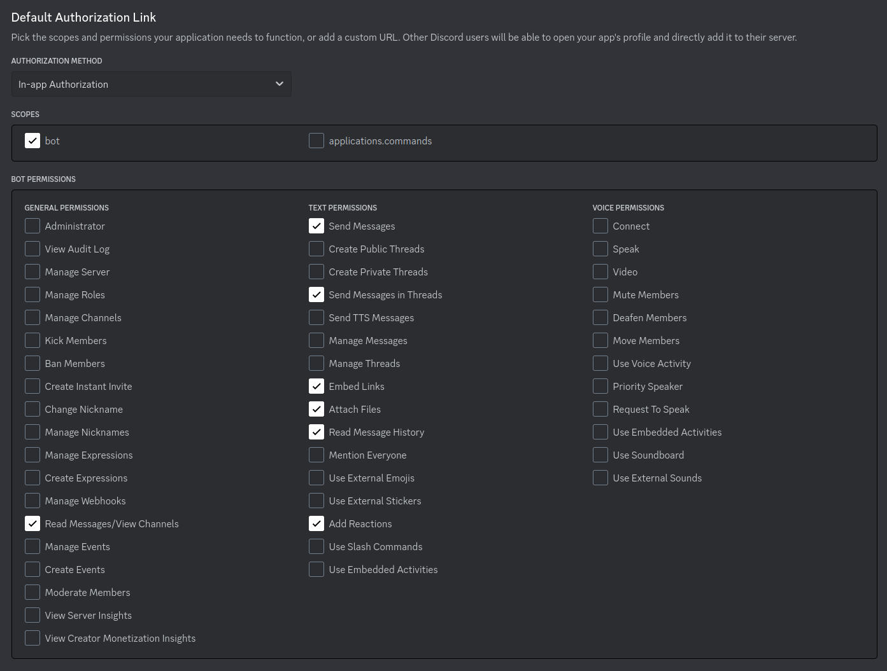
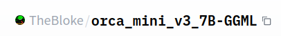

# Installing and running Synthea

### Documentation: Installing Python and Project Dependencies
This documentation will guide you through the process of setting up Python and installing project dependencies listed in `requirements.txt`. While I encourage the use of Conda for environment and package management, it's not a strict prerequisite.

## 1. Installing Python:

### Windows:

#### Using the Official Python Installer:
   1. Visit the official Python [downloads page](https://www.python.org/downloads/windows/).
   2. Download the latest Python version for Windows.
   3. Run the installer. Ensure you check the box that says "Add Python to PATH" during the installation process.
   4. Complete the installation.

#### Using Conda (Optional but Recommended):
   1. Install Miniconda or Anaconda:
      - [Miniconda Installer](https://docs.conda.io/en/latest/miniconda.html)
      - [Anaconda Installer](https://www.anaconda.com/products/distribution)
   2. Follow the on-screen instructions. 

### Linux:

1. **Using the Package Manager**:
   ```bash
   sudo apt update
   sudo apt install python3
   ```

2. **Using Conda (Optional but Recommended)**:
   1. Install Miniconda:
      1. Download the Miniconda installer:
         ```bash
         wget https://repo.anaconda.com/miniconda/Miniconda3-latest-Linux-x86_64.sh
         ```
      2. Make the installer script executable:
         ```bash
         chmod +x Miniconda3-latest-Linux-x86_64.sh
         ```
      3. Run the installer:
         ```bash
         ./Miniconda3-latest-Linux-x86_64.sh
         ```

---
## 2. Installing Python dependencies:

### With Conda and a Nvidia card:
Begin by installing CUDA 12. Refer to [the nvidia website](https://developer.nvidia.com/cuda-downloads?) for instructions on how to install CUDA on your device.

Afterwards, use the following command to install the project. 

```bash
. ./install.sh
```

This file will create a new Conda environment and install the dependencies.


### Without Conda or a Nvidia card:
If you do not have a CUDA card or would prefer not to use conda, use the following command to install the python dependencies:

```bash
pip install -r requirements.txt
```

Then, install llama-cpp-python. If you are only going to use the CPU, you can use the following command:
```bash
pip install llama-cpp-python
```
Otherwise, refer to [the llama-cpp-python documentation](https://github.com/abetlen/llama-cpp-python) for the commands to install a GPU backend
that works for your hardware.

## 3. Setting up a bot on discord

### 1. Setting Up a Bot on the Discord Developer Portal

1. Go to the [Discord Developer Portal](https://discord.com/developers/applications).
   
2. Click on the `New Application` button.

3. Enter a name for your application and click `Create`.

4. In the sidebar on the left, click on `Bot`.

5. Click the `Add Bot` button, then confirm by clicking `Yes, do it!`.

### 2. Adding Your Bot to a Discord Server

1. In the Developer Portal, under your bot's page, click on `OAuth2` in the sidebar.

2. Under the `General` section, select the `bot` checkbox in the `SCOPES` box.

3. In the `BOT PERMISSIONS` box, select the following permissions.


4. Migrate to the `OAuth2 URL Generator` section. As before, select the `bot` checkbox in the `SCOPES` box.

5. In the `BOT PERMISSIONS` box, select the same permissions as before.

6. Once you've selected the permissions, a URL will be generated in the `SCOPES` box. Copy this URL.

7. Paste the URL into your web browser, which will guide you to add the bot to one of your Discord servers.

8. Choose the server and click `Authorize`.

## 3. Getting a model for the bot
This bot uses a large language model to generate responses to user questions. Hugging Face offers a repository of pre-trained models through their website. 

### Instructions:

1. **Selecting a Model:**
   First, navigate to the Hugging Face model hub at [Hugging Face Models](https://huggingface.co/models). Browse or search to find the model you'd like to download.

   This bot is designed to use llama.cpp compatible models. llama.cpp uses GGML quantization, so only GGML models are compatible with this bot. If you don't know
   where to start, consider using orca_mini, a highly general model with good reasoning skills. The model comes in [7B](https://huggingface.co/TheBloke/orca_mini_v3_7B-GGML/)
   and [13B](https://huggingface.co/TheBloke/orca_mini_v3_13B-GGML) version. The 7B version can be run on most consumer graphics cards with 8GB of VRAM or more, such
   as the 3070 or 3060. The 13B model can run on most consumer graphics cards with 12GB of VRAM or more. If you are running on the CPU, the system RAM rather
   than the VRAM will be the biggest limiter. 
   
   When you have selected your model, download the file ending in `.q4_K_S.bin` to your computer. You can download any one of the .bin files, but I find this
   format strikes a good balance of quality and memory footprint. 

2. **Creating the Folder:**
   At the top of the huggingface repo page is the name of the model. Navigate to the root of the repo, then click the icon to the right of the
   name of the repo to copy it to your clipboard.
   

   Then, type the following command and paste
   ```bash
   mkdir -p models/YOUR_MODEL_NAME
   ```
   Replace `YOUR_MODEL_NAME` with the text you copied from the repo.

   If you do not use a command line, use your file explorer to create a folder with the name of the author (TheBloke in our example), then navigate into that folder and
   create a folder with the name of the repo (orca_mini_v3_13B-GGML in our example)

3. **Downloading the Model:**
   Move or copy the model you downloaded into the folder you just created.

4. **Update config:**
   Open the `config.yaml` file in the root folder with a text editor.
   You will see a line that looks like:
   `model_name_or_path: "TheBloke/orca_mini_v3_13B-GGML"`
   If that does not match the model you used, replace `TheBloke/orca_mini_v3_13B-GGML`
   with the text you copied from the huggingface repo previously.

## 5. Add your token to the bot

1. Return to your bot's page on the Discord Developer Portal.

2. In the sidebar, click on `Bot`.

3. Under the `TOKEN` section, click the `Copy` button.

4. Open the `config.yaml` file in the root folder with a text editor.

5. Add the token in the appropriate section. You will see a line that says:

```yaml
client_token: "PLACE YOUR BOT TOKEN HERE"
```

Replace `PLACE YOUR BOT TOKEN HERE` with the token you copied from the Developer Portal.

6. Save and close the `config.yaml` file.

# Next steps
You're done! Now, continue to [the documentation for running the bot](run.md).
